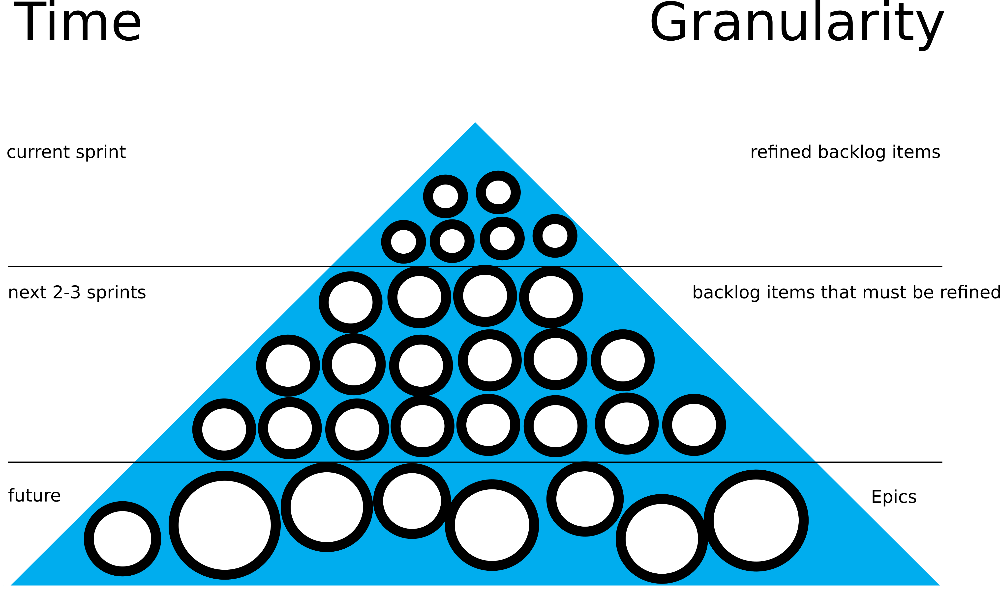

# Guidelines

This project is organized by using elements of [scrum](https://en.wikipedia.org/wiki/Scrum_(software_development)).

It is based on the four values:

* Commitment

* Focus

* Openness

* Respect

* Courage

and has three conditions:

* Transparency (Information must be available to everyone)

* Inspection (Decide in specific time intervals if the current working method is effective.)

* Adaption (If the teams detects methods that can be improved it must do that!)

## Definition of Done

We say a task (sprint item) is done if 

* It is reviewed by one of the team members.

* It is documented either in the technical or the user documentation.

* The final result is available on the staging instance.

## Task Management

There are three different types of tasks which are depicted in the following figure:

* The main vision is represented in Epics. Epics are not definied in detail and can change in future. 
  Those can be found in the Github Repository. They are created by the product owner.

* Backlog items that must be refined are defined as GitHub projects. Those items must be discussed with the developer teams in order to prepare tasks for the next sprint.

* Sprint items are tasks that are defined as small and independent as possible.

### Backlog Item Priority

Backlog Items are prioritized using the MoSCoW method where Tasks are labeled with

* Must have

* Should have

* Could have

* Won't have
